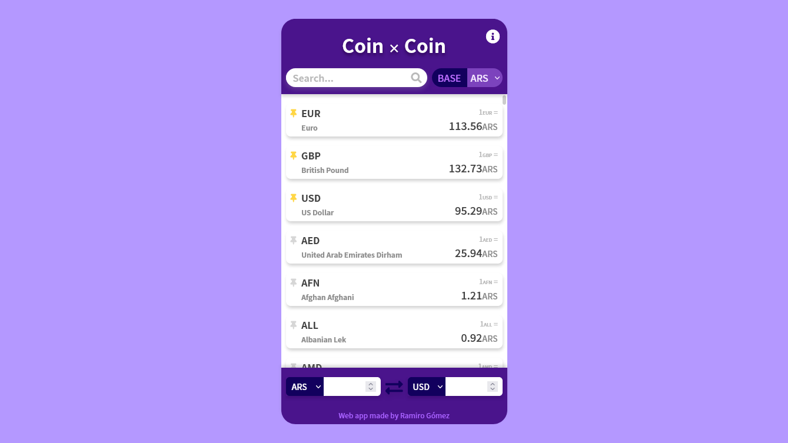

# Coin × Coin
Aplicacion web de intercambio de divisas

### 🚀 [Pulsa aqui para ver una demo de la web](https://coin-x-coin.netlify.app)


## 🔧 Esta aplicacion fue construida utilizando:
- Webpack
- Babel
- PostCSS (TailwindCSS & PostCSS-Preset-Env)
- Jest

### Para iniciar un entorno de pruebas instala las dependencias de este proyecto con el comando:
```bash
npm install
# o
yarn install
```

### Y luego inicia el entorno de pruebas con:
```bash
npm run dev
# o
yarn run dev
```

### Si en cambio deseas generar un a version de produccion, instala las dependencias y luego utiliza:
```bash
npm run build
# o
yarn run build
```

### Tambien puedes ejecutar los tests con el comando:
```bash
npm run test
# o
yarn run test
```

**A mejorar:**
- Cambiar los selectores a barras de busqueda para mejorar la experiencia y reducir la cantidad de elementos HTML
- Mejrar conversor para que sea capaz de crear todos los tipos de cambios con una sola peticion a la API y asi evitar rellamados
- Agregar criptomonedas
- Agregar dolar turista y blue para Argentina